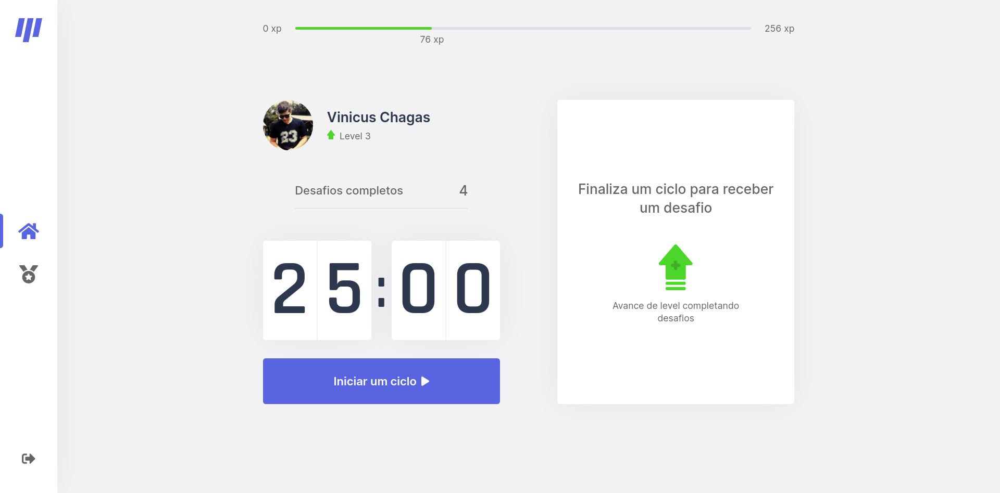
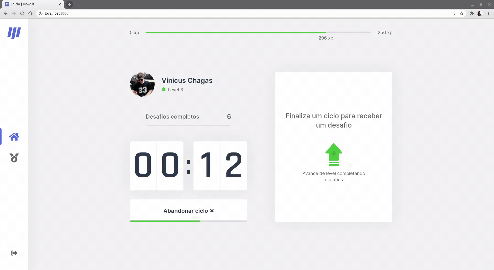
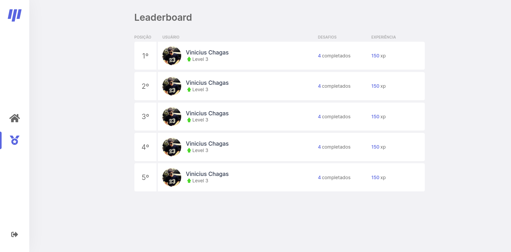

<div align="center"></div>
<br/>
<br/>
<br/>
<br/>

Nos dias de hoje costumamos passar horas trabalhando, estudando ou navegando na internet, 
o resultado disso pode ser muito projudicial para a nossa saúde. <br/>
Para evitarmos isso  precisamos fazer pequenas pausas para movimentar o nosso corpo.
<br/>
<br/>
O Move.it foi feito para nos ajudar com este problema, com um sistema semelhante a [Técnica de Pomodoro](https://en.wikipedia.org/wiki/Pomodoro_Technique)
nos lembra a cada 25 minutos de fazermos pequenos exercicios, além disso nos oferece um exercicio aleatório para o corpo ou para os ólhos. <br/>
O app também conta com um sistema de gamificação e ranking utilizando pontos de expriência e sistema de níveis.

<br/>
<br/>

## Algumas imagens do projeto

<br/>


<br/>


<br/>



<br/>



<br/>



<br/>
<br/>
<br/>
<br/>


## Instruções para uso

### 1. Clonar repositório
Você pode clonar esse repositório utilizando o comando: <br>
`` git clone https://github.com/ViniciusCChagas/moveit `` <br>
ou você pode baixar o repositório como um arquivo .ZIP

### 2. Instalar as dependências
Após isso, na pasta do projeto rode o comando
```bash
$npm install
#ou
$yarn
```
para instalar todas as dependencias do projeto. <br>

### 3. Rodar a aplicação
Depois de instalar todas as dependencias do projeto, vamos executa-lo em modo de desenvolvimento, utilizando o comando:
```bash
$npm run dev
# ou
$yarn dev
```
Após isso podemos acessar o App no endereço: http://localhost:3000.

## Ferramentas utilizadas
<li>ReactJS</li>
<li>NextJS</li>
<li>ContextAPI</li>
<li>TypeScript</li>


## Como contribuir

- Faça um fork desse repositório;
- Cria uma branch com a sua feature: `git checkout -b minha-feature`;
- Faça commit das suas alterações: `git commit -m 'feat: Minha nova feature'`;
- Faça push para a sua branch: `git push origin minha-feature`.

---

<h4 align="center">
    Feito com ♥ por Vinícius Chagas 👋 <a href="https://www.linkedin.com/in/vinicius-chagas-8b8916140/" target="_blank">Acompanhe!</a>
</h4>
